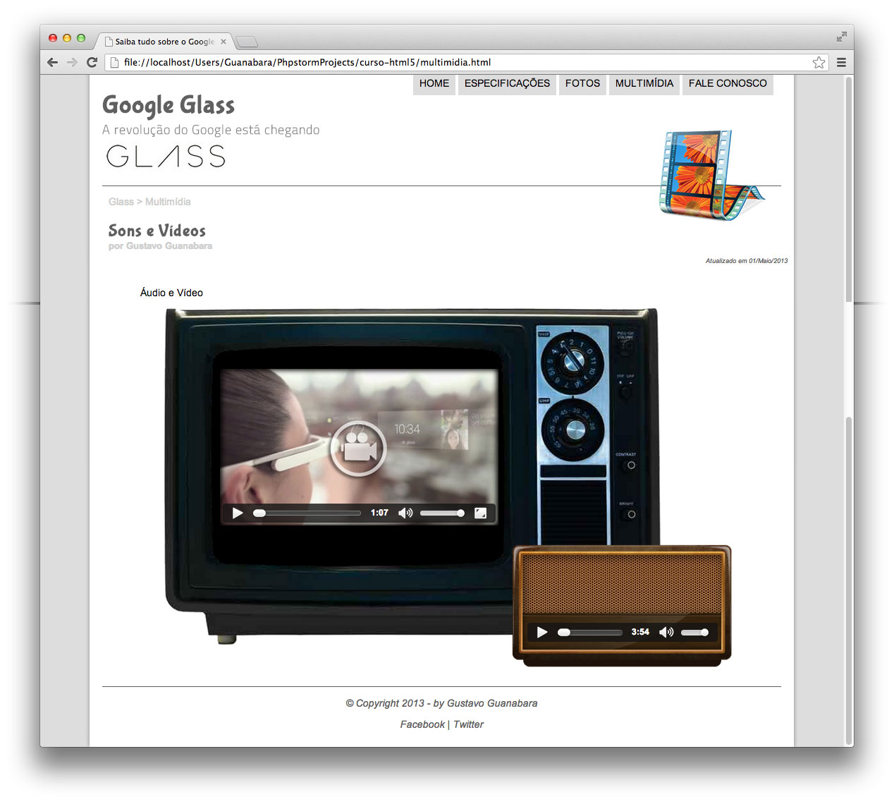

# Projeto Google Glass
O projeto Google Glass foi um projeto proposto pelo curso em vídeo em seu primeiro curso, o projeto tem o intúito de ensinar a construir uma página web, utilizando HTML5/CSS3/JavaScript.
Ele tem total de 5 páginas falando sobre o google glass, onde o cliente pode ler um artígo sobre o google glass, ver fotos, vídeos, ver especições sobre o google glass, entre outras coisas, o site term imagens interativas utilizando mapeamento de imagens CSS.

## Técnologias utilizadas:
* HTML5
* CSS3
* JavaScript

### Para visualizar basta abrir o link:

https://moisessantana.github.io/projeto-glass-html5/